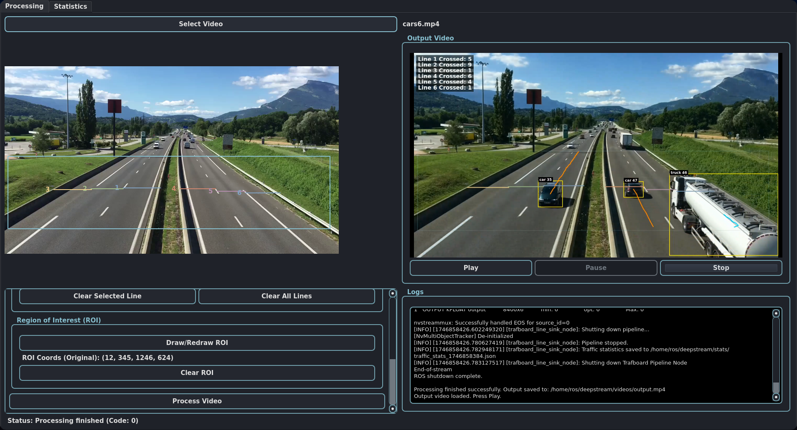
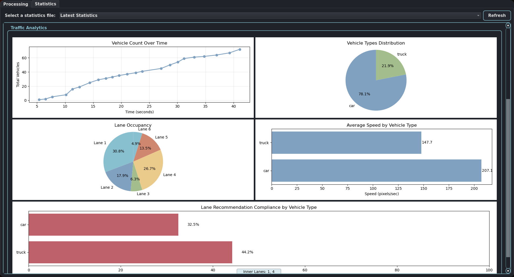

# Traffic Analytics Dashboard using DeepStream, ROS2 and PyQt

This project implements a comprehensive traffic analytics system using **NVIDIA DeepStream** for optimized inference, **ROS2** for modularity, and **PyQt6** for visualization. The system analyzes traffic patterns, vehicle crossings, lane occupation, and vehicle-type compliance with designated lanes.

## System Overview

The system consists of three main components:
1. **DeepStream Pipeline** - Optimized ML inference engine for object detection and tracking
2. **ROS2 Integration** - Middleware for component communication and modularity
3. **PyQt6 GUI** - Interactive interface for setting up analytics and visualizing results

## Demo

Below are some visuals from the application:

**Screenshot 1: Main Interface for Video Processing Setup**


**Screenshot 2: Statistics Dashboard View**


**Output Video Sample:**

https://github.com/user-attachments/assets/e9c3f790-6aa6-464f-b539-89f3e6b08367

## Features

- **Vehicle Detection and Tracking** - Identify and track vehicles across frames
- **Line Crossing Analytics** - Count vehicles crossing designated lines
- **Vehicle Type Categorization** - Identify different vehicle types (car, truck, bus, motorcycle, bicycle)
- **ROI-based Filtering** - Focus analysis on specific regions of interest
- **Lane Compliance Analysis** - Check if heavy/light vehicles are using recommended lanes
- **Statistical Visualization** - Graphs and charts showing traffic patterns, distributions, and analytics
- **Video Processing** - Process pre-recorded videos and save results

## Prerequisites

- NVIDIA GPU with CUDA support
- Ubuntu 20.04+ with Python 3.8+
- NVIDIA DeepStream 6.2+
- ROS2 Humble
- PyQt6

## YOLOv8 Object Detection

The system uses YOLOv8m as the object detection model, which provides fast and accurate detection of various vehicle types:

- Car
- Truck
- Bus
- Motorcycle
- Bicycle

YOLOv8 is integrated with DeepStream using NVIDIA's TensorRT for optimized inference. The model has been configured to filter for vehicle classes from the COCO dataset, ignoring irrelevant classes like person, airplane, etc.

### YOLOv8 DeepStream Integration

The model is converted to ONNX format and optimized with TensorRT using the process:
```bash
# Export YOLOv8 to ONNX format
python3 export_yoloV8.py -w yolov8m.pt --dynamic --simplify
```

The configuration for the YOLOv8 detector is stored in `config_inferyolov8.txt`.

## DeepStream Pipeline Architecture

### Core Pipeline Classes

1. **NodeFileSinkPipeline**
   - Base class for ROS2-integrated DeepStream pipelines with file output
   - Handles GStreamer pipeline setup for processing and saving video files

2. **TrafboardPipeline**
   - Extends NodeFileSinkPipeline with traffic analysis capabilities
   - Manages line crossing detection, vehicle tracking, ROI filtering
   - Collects and processes traffic statistics

### Pipeline Elements

The pipeline is composed of these GStreamer elements:
- `filesrc` - Reads input video file
- `nvv4l2decoder` - Hardware-accelerated video decoding
- `nvstreammux` - Batches frames for efficient processing
- `nvinfer` - Runs the YOLOv8 model for object detection
- `nvtracker` - Tracks objects across video frames
- `nvvideoconvert` - Handles format conversions
- `nvdsosd` - Overlays detection, tracking and analytics visualization
- `nvv4l2h264enc` - Hardware-accelerated video encoding
- `filesink` - Saves processed output to a file

## Traffic Analytics Components

### Vehicle Detection & Tracking

The system detects and tracks 5 vehicle classes:
- Car
- Truck
- Bus
- Motorcycle
- Bicycle

Each detection includes bounding box, class ID, tracking ID, and movement trajectory.

### Line Crossing Detection

The system allows defining multiple horizontal lines in the video frame. When vehicles cross these lines, the system:
- Counts the crossing event
- Records the vehicle type
- Determines the direction (inbound/outbound)
- Updates statistical counters

### Lane Compliance Analysis

The user can designate lanes as:
- **Inner Lanes** - Recommended for heavy vehicles (trucks, buses)
- **Outer Lanes** - Recommended for light vehicles (cars, motorcycles, bicycles)

The system tracks compliance rates and provides analytics on whether vehicles are using appropriate lanes.

### Statistical Analysis

The system generates comprehensive statistics:
- **Vehicle Counts** - Total vehicles by type, direction, and crossing point
- **Traffic Flow** - Time-series analysis of vehicle movement
- **Vehicle Type Distribution** - Percentage breakdown of vehicle types
- **Average Speeds** - Estimated speeds by vehicle type
- **Lane Occupancy** - Percentage of time each lane is occupied
- **Lane Compliance** - How well vehicles adhere to recommended lane usage

## PyQt GUI Interface

The graphical user interface provides:

1. **Video Input Processing**
   - Select and preview input videos
   - Define regions of interest (ROI)
   - Draw line crossing points
   - Designate inner/outer lanes

2. **Video Output Display**
   - View processed video with visualizations
   - Basic playback controls

3. **Statistics Dashboard**
   - Interactive charts and graphs
   - Time-series data visualization
   - Vehicle type distribution
   - Lane occupancy analysis
   - Lane compliance rates

## Usage Instructions

### Installation

1. **Install dependencies**:
```bash
# ROS2 and DeepStream should be installed first

# Install PyQt and other requirements
pip install PyQt6 numpy matplotlib opencv-python
```

2. **Prepare the environment**:
```bash
# Create stats directory for storing analytics
mkdir -p ~/deepstream/stats
mkdir -p ~/deepstream/videos
```

### Running the Application

1. **Launch the PyQt interface**:
```bash
cd ~/deepstream
python pyqt_line_ui.py
```

2. **Process a video**:
   - Click "Select Video" to choose an input video
   - Draw lines where you want to count vehicles (horizontal lines across lanes)
   - Optionally draw a Region of Interest (ROI) to focus detection
   - Designate inner lanes (for heavy vehicles) and outer lanes (for light vehicles)
   - Click "Process Video" to start analysis

3. **View statistics**:
   - After processing, the application automatically switches to the "Statistics" tab
   - Explore the various charts and graphs showing traffic analytics
   - Review lane compliance metrics to see if vehicles are using appropriate lanes

## File Structure

```
~/deepstream/
├── pyqt_line_ui.py       # Main PyQt GUI application
├── trafboard.py          # DeepStream traffic analysis pipeline
├── deepstream_class.py   # Base classes for DeepStream pipelines
├── config_inferyolov8.txt  # YOLOv8 model configuration
├── config_tracker.txt    # DeepStream tracker configuration
├── stats/                # Output statistics in JSON format
└── videos/               # Output processed videos
```

## Advanced Usage

### Custom Line Configurations

The system allows for complex line crossing setups:
```
python trafboard.py --lines 1 100 400 500 400 --lines 2 200 600 600 600
```

### Lane Designation for Compliance Analysis

Specify which lanes are for which vehicle types:
```
python trafboard.py --inner-lanes 2 3 --outer-lanes 1 4 5
```

## Development Architecture

### TrafficStats Class

Tracks and calculates all traffic statistics:
- Vehicle counts by type, line, and direction
- Time-series data across the video duration
- Speed estimation based on pixel movement
- Lane occupancy measurements
- Lane compliance rates

### StatsTab Class

PyQt component for visualizing analytics:
- Time series charts of traffic flow
- Pie charts of vehicle type distribution
- Lane occupancy visualization
- Lane compliance bar charts

## License

This project is licensed under the MIT License - see the LICENSE file for details.

## Acknowledgments

- NVIDIA for DeepStream SDK
- Ultralytics for YOLOv8
- PyQt team for the GUI framework
- ROS2 community for the middleware platform
